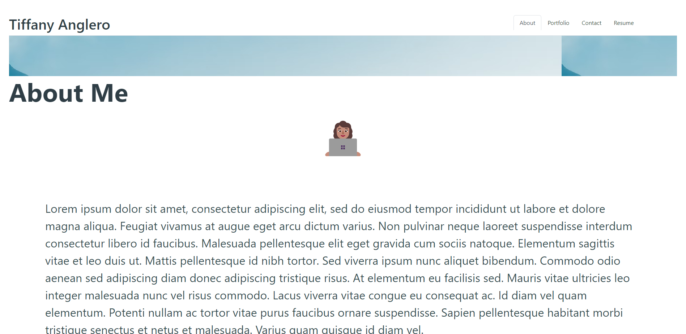

# Readme Generator
 ## License

          
## Table of Content 
- [Project Description](#Description)
- [Usage](#Usage)
- [Contribution](#Contribution)
- [Email](#Email)
- [Github](#Github)
## Description
This portfolio was created to create an app to showcase my react knowledge and display the projects I`ve learned throught bootcamp. Employers can explore my page to lean about me, my work, contact me and download my resume.

## Usage
Visit site : https://tanglero4.github.io/Professional-Portfolio/

## Contributing
Tiffany Anglero

## Questions 
Contact

Email: tiffanyanglero94@hotmail.com

GitHub: https://github.com/https://github.com/tanglero4?tab=repositories   
